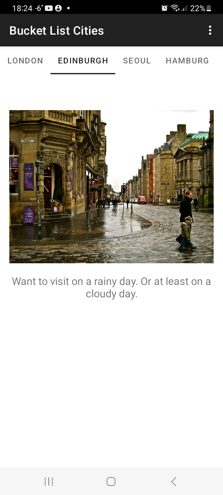
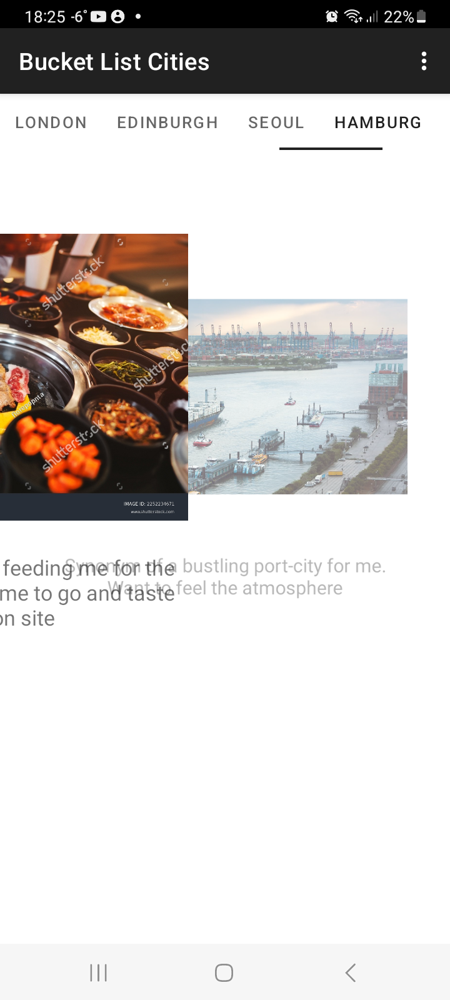
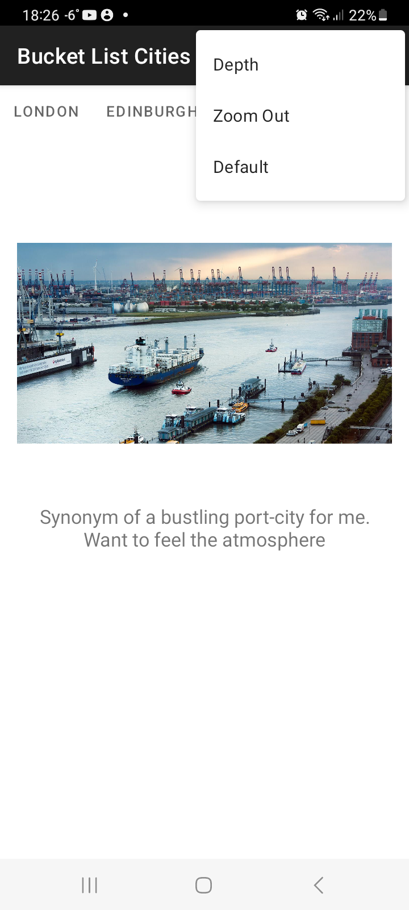

# Cities to go 

Small project to practice using ViewPager2 along with TabLayout 

## Stack
- **FragmentStateAdapter** creates a new instance of a Fragment when next tab is selected. Information about the corresponding city is passed via Bundle
- **TabLayout** is used to create tabs for each page 
- To bind TabLayout with ViewPager **TabLayoutMediator** is used.
- For fancy scrolling 2 different **ViewPager2.PageTransformer** were added - ZoomOut and Depth. There is a menu that lets choose between transformations.

